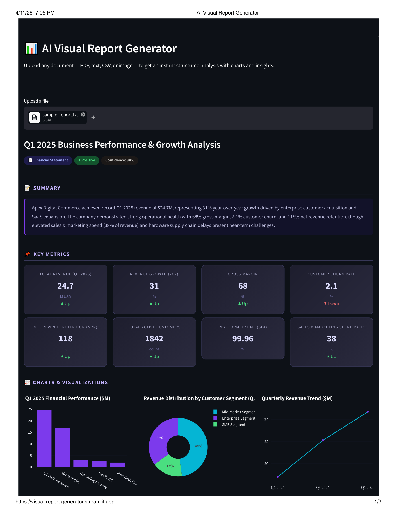
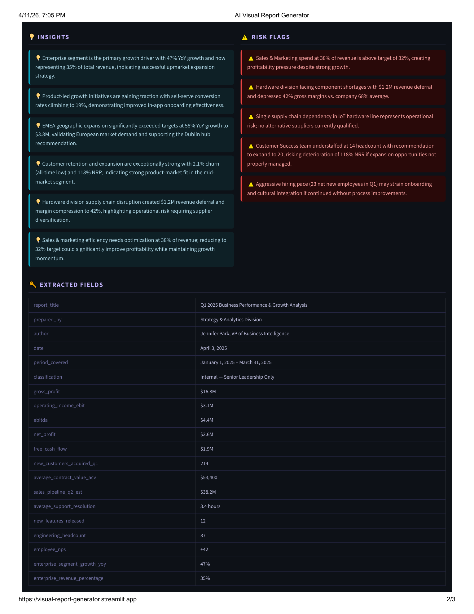

# 📊 AI Visual Report Generator

Upload any document and get a structured, visual analytical report in seconds.

**Live Demo:** [visual-report-generator.streamlit.app](https://visual-report-generator.streamlit.app/)

---

## What It Does

Drop in any file — a financial report, business summary, CSV, image, or plain text — and the app automatically:

- Extracts key metrics, figures, and fields from the document
- Generates a plain-English summary and actionable insights
- Identifies risk flags and anomalies
- Renders interactive bar, donut, and line charts based on the data it finds
- Exports the full report as a downloadable PDF

No configuration needed. Works with any document type.

---

## Screenshots

### Dashboard Overview — KPI Cards, Summary & Charts


### Insights, Risk Flags & Extracted Fields


---

## Features

- **Multi-format input** - PDF, CSV, plain text, JPG, PNG
- **Automatic metric extraction** - pulls out numbers, dates, names, and key fields without any setup
- **Smart chart generation** - bar, donut, and line charts rendered only when relevant data is found
- **Insight and risk detection** - surfaces what is working well and what needs attention
- **Sentiment and confidence scoring** - shows document tone and extraction confidence at a glance
- **PDF export** - download a clean report with one click
- **Report history** - all past reports saved and accessible in session

---

## Example Output

The screenshot above was generated from a Q1 2025 business performance report. The app extracted:

- 8 KPI cards including total revenue ($24.7M), gross margin (68%), and customer churn (2.1%)
- 3 charts: financial performance bar chart, revenue distribution donut, and quarterly trend line
- 6 business insights and 5 risk flags
- 25+ extracted fields including author, dates, segment breakdowns, and hiring data

---

## Tech Stack

| Layer | Technology |
|---|---|
| Frontend / App | Streamlit |
| AI Analysis | Claude API (Anthropic) |
| Document Parsing | PyMuPDF, python-docx |
| Charts | Plotly |
| PDF Export | ReportLab |
| Database | SQLite |
| Deployment | Streamlit Cloud |

---

## Setup (Run Locally)

**1. Clone the repo**
```bash
git clone https://github.com/bhavinjain28/visual-report-generator.git
cd visual-report-generator
```

**2. Install dependencies**
```bash
pip install -r requirements.txt
```

**3. Add your API keys**

Create a `.env` file in the root folder:
```
ANTHROPIC_API_KEY=sk-ant-your-key-here
HF_API_KEY=hf_your-key-here
```

Get your Anthropic key at [console.anthropic.com](https://console.anthropic.com) and your Hugging Face token at [huggingface.co/settings/tokens](https://huggingface.co/settings/tokens).

**4. Run the app**
```bash
streamlit run app.py
```

The app opens at `http://localhost:8501`.

---

## Project Structure

```
visual-report-generator/
├── app.py              # Main Streamlit app and UI
├── analyzer.py         # Claude API integration and document analysis
├── processor.py        # File extraction (PDF, CSV, image, text)
├── gemini_gen.py       # Visual panel generation via Hugging Face
├── report_builder.py   # PDF export using ReportLab
├── database.py         # SQLite report history
├── requirements.txt
└── screenshots/
```

---

## Author

**Bhavin Jain** 
[LinkedIn](https://linkedin.com/in/bhavin-jain-2804/) · [GitHub](https://github.com/bhavinjain28) · bhavinjain28@icloud.com
